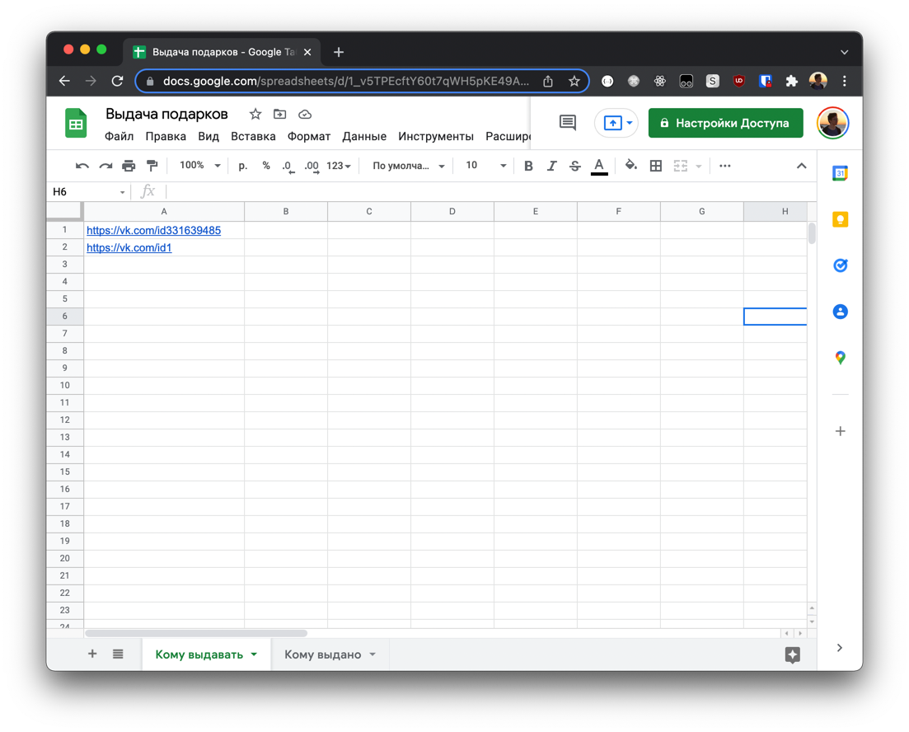
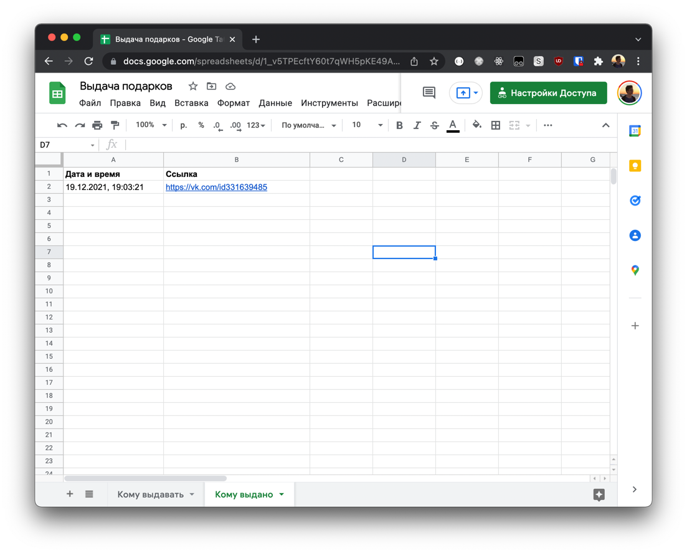
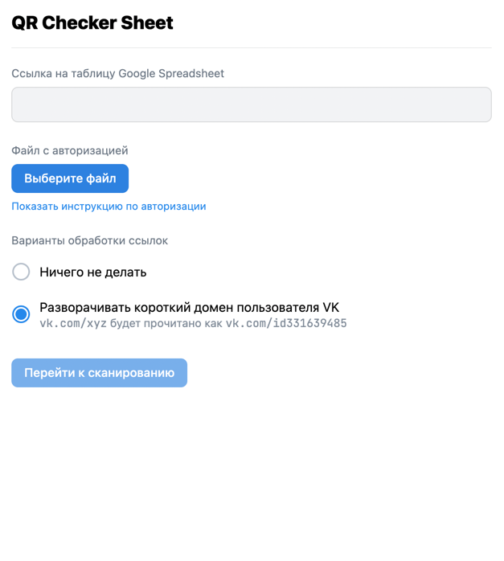
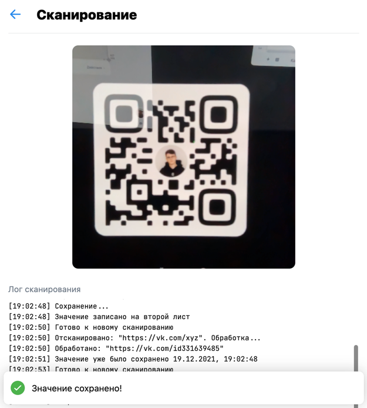

# QR Checker Sheet

Приложение VK Mini Apps для автоматизации проверок QR-кодов в таблице Google Spreadsheet.

https://vk.com/app8030943

Таблица должна быть открыта для редактирования по ссылке.

## Кейсы

### Выдача подарков

Имеется таблица, в которой перечислены ссылки на страницы VK всех пользователей, которым нужно выдать подарок.
Пользователь показывает свой QR код в приложении VK и автоматически отмечается в таблице.

Решается проблема ручного поиска ссылки на пользователя в обоих листах.

| Список допустимых значений | Значения, прошедшие проверку
| ------------- |:-------------:
|  | 

| Настройка | Сканирование           
| ------------- |:-------------:
|  | 
